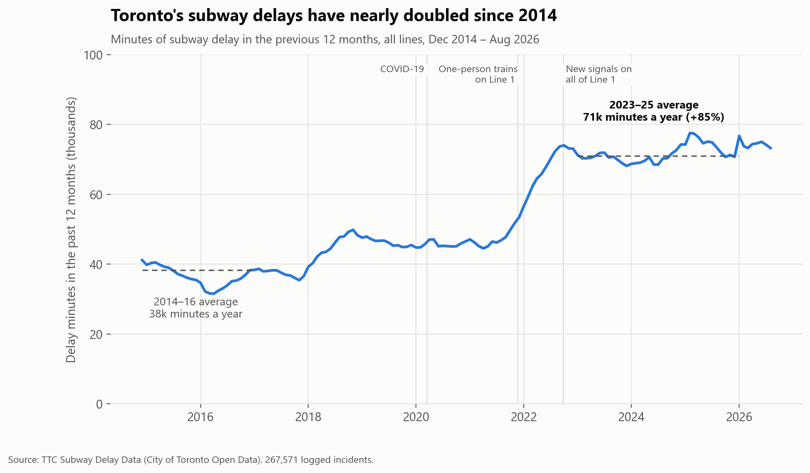
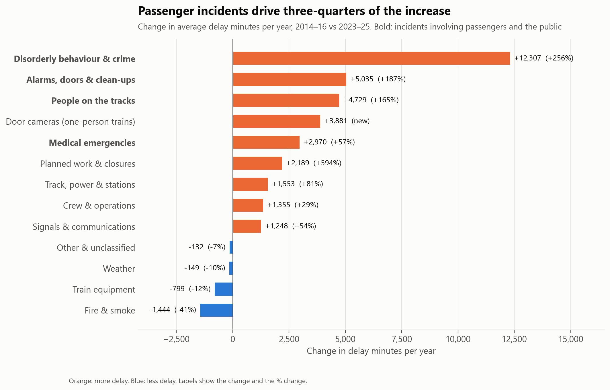
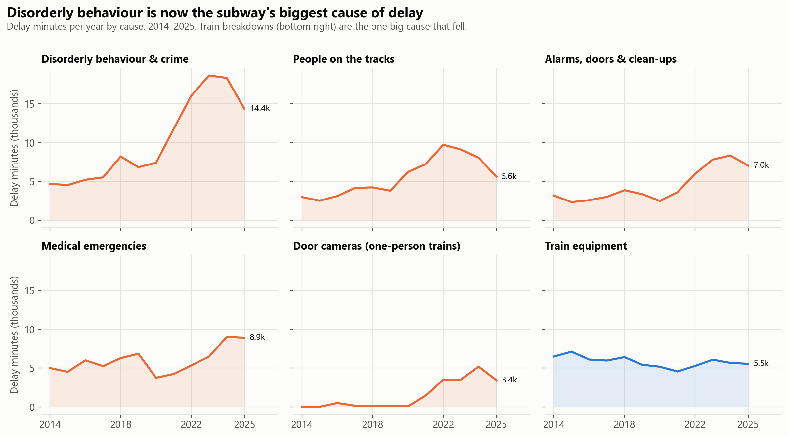
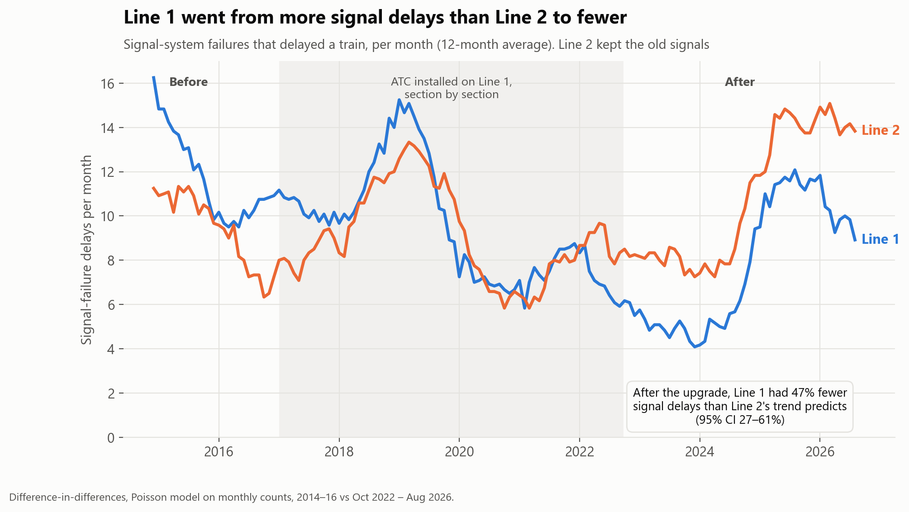
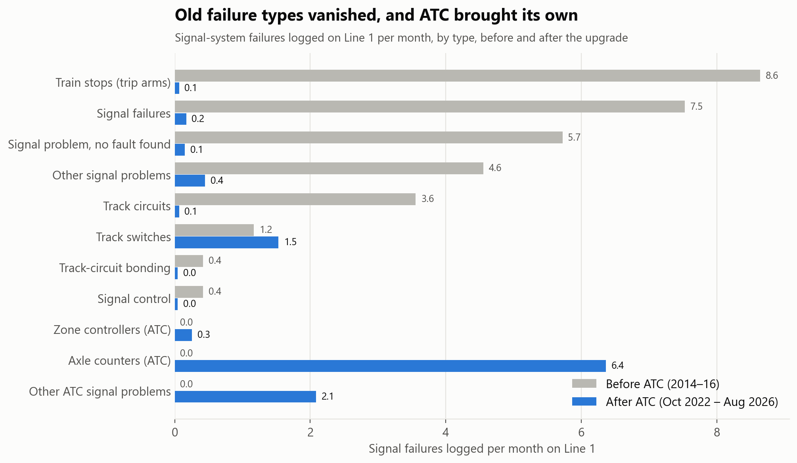
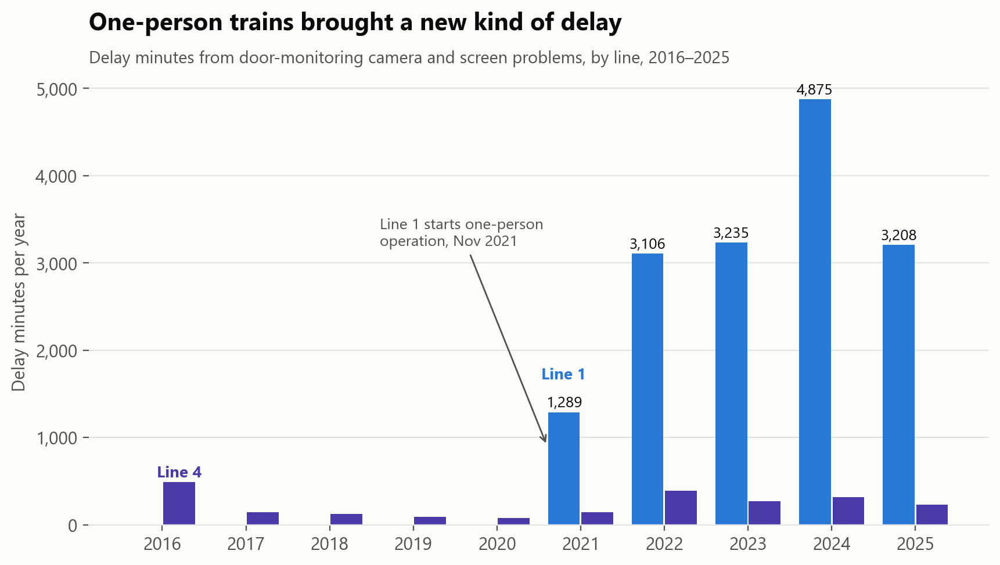
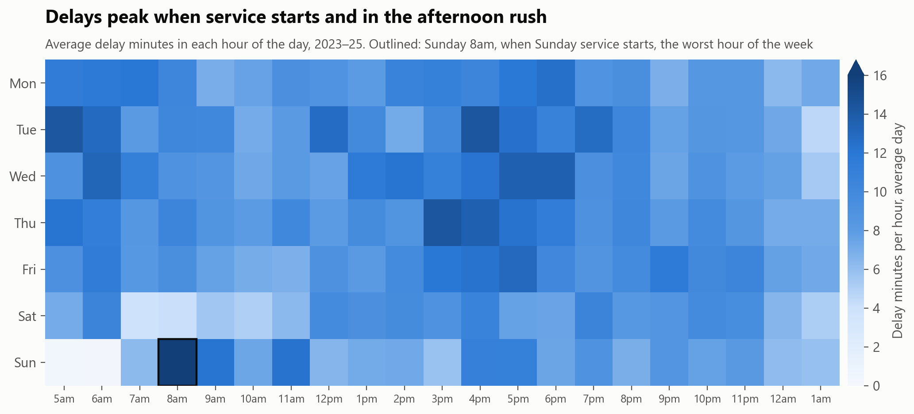
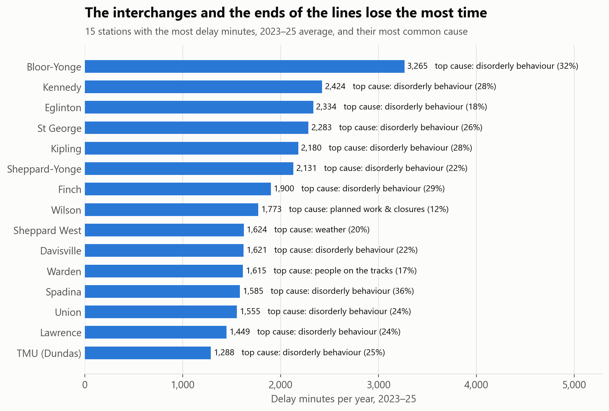

# Toronto's subway delays nearly doubled. What's behind them?

The TTC logs every incident on the subway: when, where, a cause code, and how many minutes it delayed service. I cleaned **267,571 incidents from January 2014 to August 2026** and asked what changed. In 2023–25 the subway lost an average of **71,000 minutes a year** to delays, up **85%** from 38,000 in 2014–16.



<!-- business:start -->
## Business impact

- **Question:** What's really causing Toronto's subway delays, and where should the TTC act?
- **Key finding:** Delay minutes rose 85% since 2014, and three-quarters of the increase comes from incidents involving passengers and the public. Train breakdowns fell 12%, and Line 1's new signal system halved its signal delays.
- **Recommendation:** Spend where the minutes went: faster response to passenger, security and track-level incidents (57% of delay minutes) and Line 1's door cameras. Line 1's results support upgrading Line 2's signals.
- **Estimated impact:** **76%** of the increase in delays comes from passengers and the public, not the trains. Passenger and public incidents now cost about 40,600 delay minutes a year, so every 10% cut in them saves about 4,000.
- **Case study:** [boredmongoose.github.io/projects/ttc.html](https://boredmongoose.github.io/projects/ttc.html)
<!-- business:end -->

## Short answer

| # | Finding | Evidence |
|---|---|---|
| 1 | **Delays nearly doubled, and they last longer.** | Delay minutes +85%. Delays +57%, average length 6.7 → 8.0 minutes, and delays of 30+ minutes went from 92 to 223 a year. Line 2, unchanged since 1980, rose 65%, so most of this isn't network growth |
| 2 | **Three-quarters of the increase involves passengers and the public.** | Disorderly behaviour (3.6× higher), people on the tracks, passenger alarms and medical emergencies account for **76%** of the extra minutes. Disorderly behaviour is now the biggest cause, at 24% of all delay |
| 3 | **The trains themselves got *more* reliable.** | Delays from train equipment fell **12%**, and fire and smoke delays fell 41% |
| 4 | **Line 1's new signal system worked.** | After automatic train control (ATC) went live, Line 1 had about **half the signal-failure delays** Line 2's trend predicts (rate ratio 0.53, 95% CI 0.39–0.73) |
| 5 | **One-person trains added a new kind of delay.** | Door-monitoring camera problems have cost Line 1 about **3,600 minutes a year** since 2022, 5% of all delay |



## 1. It's mostly not the trains

I grouped the TTC's 234 delay codes into 13 plain-English causes. Comparing an average year in 2014–16 with 2023–25:

- **Disorderly behaviour & crime:** 4,800 → 17,100 minutes a year. The single biggest code is "disorderly patron", at 12% of all delay. It peaked in 2023 and fell 23% by 2025, after the city and TTC added safety staff in January 2023.
- **People on the tracks** (trespassers, and people struck by trains): 2,900 → 7,600.
- **Passenger alarms, held doors and clean-ups:** 2,700 → 7,700.
- **Medical emergencies:** 5,200 → 8,100.
- **Train equipment:** 6,600 → 5,800, *down* 12%.



## 2. Did Line 1's new signals help? A natural experiment

Line 1 switched to **automatic train control (ATC)** section by section from 2017, finishing on 24 September 2022. Line 2 still uses the old fixed-block signals, so it shows what would probably have happened to Line 1 without the upgrade (a **difference-in-differences** design).

| | Line 1 (got ATC) | Line 2 (old signals) |
|---|---|---|
| Signal-failure delays per month, 2014–16 | 12.3 | 9.4 |
| Signal-failure delays per month, Oct 2022 – Aug 2026 | **7.9** (−36%) | **11.3** (+20%) |

A Poisson model on monthly counts puts Line 1's signal delays at **0.53×** what Line 2's trend implies (95% CI 0.39–0.73, p < 0.001). Three checks back it up:
- **Parallel trends:** before the upgrade, the two lines' signal delays moved together (difference in monthly trend p = 0.98).
- **Different comparison line:** using Line 4 instead of Line 2 gives 0.58.
- **Placebo outcome:** Line 1's *non-signal* delays rose faster than Line 2's (1.50×), so the drop is specific to signals, not a better-run line overall.



The failure types changed completely. Track circuits and train stops (trackside trip arms) almost never fail on Line 1 any more. ATC brought its own failures, mainly axle counters, and those have been creeping up since 2023.



## 3. One-person trains: a new kind of delay

With one-person train operation, the guard at the back is gone and the operator checks the doors on camera screens. Line 1 started in November 2021. When the cameras or screens fail, trains are held. That now costs Line 1 more delay than its signal system does. This doesn't show one-person operation was a bad trade, because the data can't count delays the guards used to cause or prevent. But it's a cost worth tracking.



## 4. When and where

<p float="left">
  
  
</p>

- **Two daily peaks: when service starts and the afternoon rush.** The first hour of service fails differently. There, **77%** of delay minutes come from trains, track, crews and overnight work that isn't finished on time, against 30% for the rest of the day.
- **Interchanges and the ends of the lines** (Bloor-Yonge, Kennedy, St George, Kipling, Finch) log the most delay, and disorderly behaviour is the top cause at 12 of the 15 worst stations.
- **Most incidents delay nobody:** 64% cause no delay. The 1% that last 30+ minutes cause **a fifth** of all delay.

## How it's built

```
Toronto Open Data (CKAN API) ─> 23 Excel sheets + 1 CSV ─> Python cleaning ─> SQL models (DuckDB) ─> marts ─> notebook
                                                            (lines, stations,    + 18 data-quality checks
                                                             codes, duplicates)
```

**Cleaning** ([`src/prepare_data.py`](src/prepare_data.py)). The logs are typed by hand:
- **Lines:** the line field has **111 spellings** ("YU/BD", "B/D", "BLOOR DANFORTH LINE 2", bus routes typed into the subway log). These became 5 values, and blanks were filled from the station where it serves only one line.
- **Stations:** **2,221 location spellings** ("YONGE BD STATION", "SCARB CTR STATIO", "GLENCARIN STATION") were mapped to the 75 stations with an alias list, matched longest-first as whole words, then fuzzy matching for typos. 99.9% of incidents resolve to a station, a between-stations segment, a yard or a line-wide location. Every mapping is saved in [`station_mapping.csv`](data/processed/station_mapping.csv).
- **Renamed stations:** Dundas became TMU in 2025, Eglinton West became Cedarvale, and Downsview became Sheppard West.
- **Text encoding:** the TTC's own code list is double-encoded (an en dash shows up as "â"), which the cleaning repairs.
- **Duplicates:** 271 exact duplicate rows are removed.

**SQL** ([`sql/`](sql)):
- Window functions: rolling 12-month sums, `RANK`, `ROW_NUMBER` to find each station's top cause, and shares via `SUM() OVER ()`.
- `GROUPING SETS` for line and all-lines totals, `FILTER` aggregates, and a SQL macro for cause families.
- A generated month × line grid, so months with no failures count as zeros.

**Data-quality checks** ([`03_data_quality.sql`](sql/03_data_quality.sql)). The pipeline stops if any of the 18 checks fails:
- Every raw row is accounted for.
- No month is missing.
- Only valid line values remain.
- 99.9% of locations are matched.
- The log's weekday column agrees with the date.
- The gap between trains is at least the delay for 95%+ of delays.
- Line 3 rows after its closure carry no delay.
- Every summary table adds back up to the incident table.

## Limitations

- **Delay minutes measure service, not passengers.** A 10-minute delay at 8am affects far more riders than one at 11pm, and the data has no ridership.
- **Logging can change.** Some of the rise in disorderly-behaviour incidents may be more reporting (more staff on patrol). 1,634 incidents (0.6%), mostly in 2026, use codes that aren't in the TTC's published lists. They're grouped by the code's first letter, which names the responsible department.
- **The ATC result assumes Line 2 shows what Line 1 would have done without the upgrade.** The pre-upgrade trends support this, but it can't be proven. Line 1 also gained six stations in 2017, which if anything understates the effect.
- **Stations at the ends of lines and interchanges** log incidents that may have started elsewhere.
- **2026 covers January–August**, so it's left out of yearly comparisons.

<!-- next:start -->
## Next steps

1. Add ridership, so delays are weighted by the number of passengers they hit, not just minutes.
2. Get time-to-clear for each incident type, to find which response steps take longest.
3. Repeat the signal comparison when Line 2's upgrade starts.
4. Turn the marts into a monthly operations dashboard by line, station and cause.
<!-- next:end -->

## Project structure

```
ttc-delays/
├── data/raw/           # downloaded by src/fetch_data.py (not committed)
├── data/processed/     # incidents.csv.gz (clean log), station_mapping.csv, code_lookup.csv, cleaning_log.csv
├── data/marts/         # analysis tables exported from SQL
├── sql/                # 01_staging → 02_marts → 03_data_quality
├── src/                # fetch_data.py, prepare_data.py, run_sql.py, style.py
├── notebooks/          # ttc_delays_analysis.ipynb (+ .py source)
└── images/
```

## Reproduce

```bash
pip install -r requirements.txt
python src/fetch_data.py      # delay logs and code lists from Toronto Open Data -> data/raw/
python src/prepare_data.py    # clean lines, stations and codes -> data/processed/
python src/run_sql.py         # SQL models + 18 data-quality checks -> data/marts/
jupyter notebook notebooks/ttc_delays_analysis.ipynb
```

The City refreshes the data monthly, so a later download also includes months after August 2026.

*Data: [TTC Subway Delay Data](https://open.toronto.ca/dataset/ttc-subway-delay-data/), City of Toronto Open Data. Contains information licensed under the Open Government Licence – Toronto. Dates of the ATC and one-person-operation roll-outs are from TTC announcements.*
